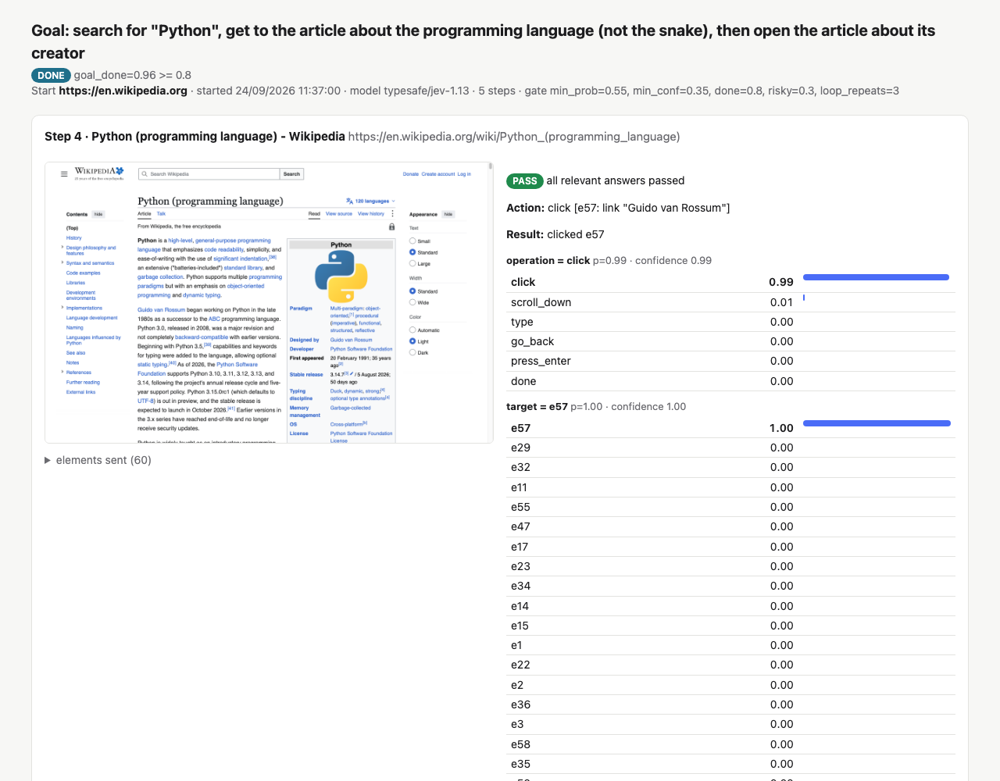
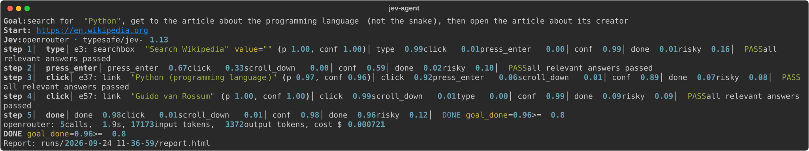
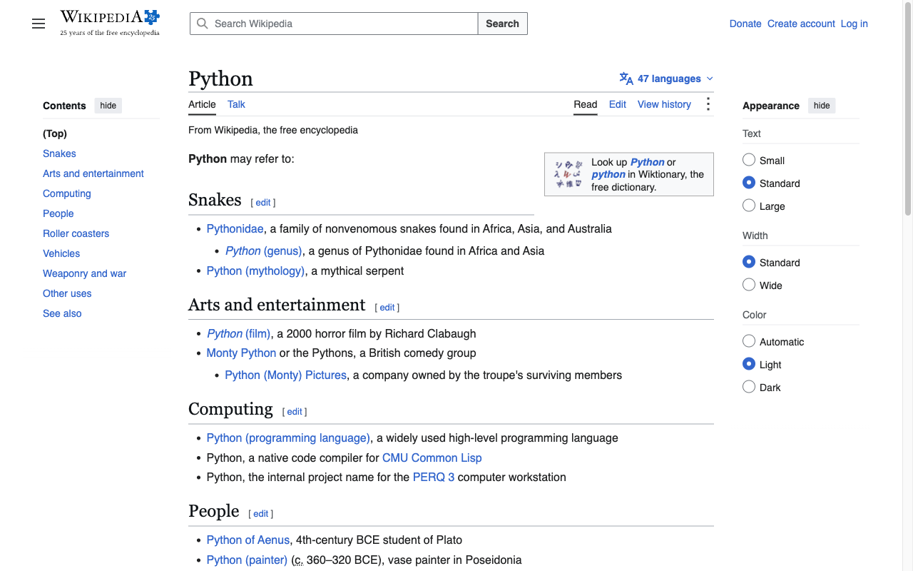
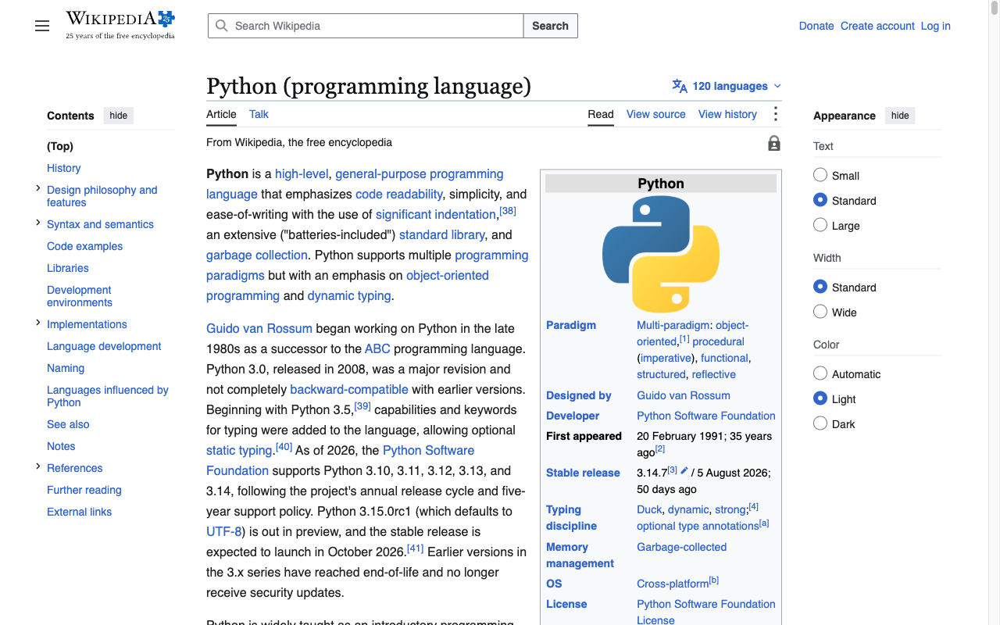
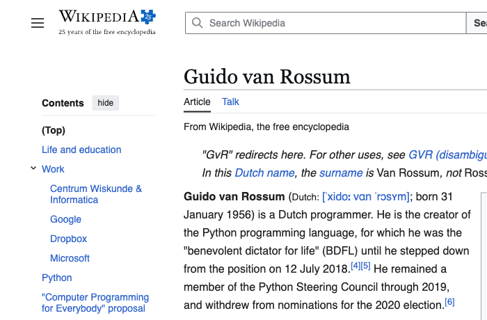

# jev-web-agent

A small, readable web agent driven only by **Jev**, TypeSafe's System One decision model, with
no LLM anywhere. Jev never writes text or actions. On each step the agent turns the page into
text, asks Jev five typed questions in one call (which operation, which element, which quoted
text, is the goal done, is the next step risky), and gets back calibrated probabilities. Code
then decides whether those answers are good enough to act on. When they aren't, a human picks
from Jev's top three, and risky steps are never executed.



*A real run's `report.html`: step 4 of "search for "Python", get to the article about the
programming language (not the snake), then open the article about its creator". The report
shows each step's screenshot, the elements sent to Jev, every answer's probabilities and
confidence, and the gate's decision.*

How it works in detail, with diagrams, a real request and response, and live results:
**[docs/design.md](docs/design.md)**.

## Quickstart

Requires Python 3.12 and [uv](https://docs.astral.sh/uv/).

```sh
git clone https://github.com/Shai-Koffman/jev-web-agent.git
cd jev-web-agent
uv sync
uv run playwright install chromium
cp .env.example .env
```

Put one key in `.env`:

- `OPENROUTER_API_KEY=...`: Jev on OpenRouter as `typesafe/jev-1.13` (get a key at
  <https://openrouter.ai/settings/keys>), or
- `TYPESAFE_API_KEY=...`: Jev on TypeSafe's own API.

Then run a starter task and watch the browser:

```sh
uv run jev-agent --task wiki     # en.wikipedia.org: search "Alan Turing", open his article
uv run jev-agent --task hn       # news.ycombinator.com: open the top story's comments
uv run jev-agent --task books    # books.toscrape.com: open "A Light in the Attic"
```

Or give it your own goal. Put any text it may type in double quotes:

```sh
uv run jev-agent --goal 'search for "Ada Lovelace" and open her article' --url https://en.wikipedia.org
```

## See it run

The terminal prints one line per step: the operation, the target element with its probability
and confidence, the operation's top three, the two Noul values, and the gate's verdict. This is
the Python run replayed from its `run.json`:



The same run in the browser:

| Step 3: the disambiguation page | Step 4: the programming language | Step 5: goal reached |
| --- | --- | --- |
|  |  |  |

On step 3 Jev picked `e37: link "Python (programming language)"` with p 0.97, choosing it over
the snakes. On step 4 it picked `e57: link "Guido van Rossum"` with p 1.00.

## Safety

This is an example, not a product. Read this before pointing it anywhere.

- **It only types what you quoted.** The only text the agent can ever type is a double-quoted
  literal from your goal. Jev chooses among those literals and cannot invent text. Code checks
  it again before every `type`, including one a human picked, and aborts the run if it doesn't
  match.
- **Risky steps are blocked.** Every step asks Jev whether the next step would buy, pay, send
  a message, post, delete, submit personal data or log in. At a probability of 0.3 or more the
  agent does not execute it. When a human overrides Jev's choice, that pick gets its own risk
  check.
- **Unsure means stop.** Low probability or confidence, or the same action three times, stops
  and asks a human. With `--no-ask` it aborts instead.
- **Don't use it where one click can buy or send.** The risk check is a model's probability,
  not a guarantee. Use read-only sites, and never run it logged in to accounts that can spend
  money or send messages.
- Keys are loaded from `.env`, which is gitignored. They are never printed or written to a
  report.

## How it works

```
observe ──► decide (1 Jev call) ──► gate ──► act ──┐
   ▲                                                │
   └────────────────────────────────────────────────┘
```

1. **Observe** (`observe.py`). Playwright tags visible, enabled interactive elements with
   `data-jev-id`. Tagging runs in document order and stops at 60 elements, taking in-viewport
   elements first. Each element becomes one line, such as `e3: searchbox "Search Wikipedia"
   value=""`. The state is the goal, url, title, a text excerpt of up to 3,000 characters, the
   element lines, and the last 5 actions.
2. **Decide** (`decide.py`). One Jev call asks five questions at once, listed with their
   exact options in [The five questions](#the-five-questions) below.
3. **Gate** (`agent.py`). The checks run in this order:
   - `goal_done ≥ 0.8`, or a confident `done` → finish.
   - An unknown operation → abort.
   - `risky ≥ 0.3` → block.
   - Each answer the chosen operation depends on needs probability ≥ 0.55 and
     confidence ≥ 0.35. Otherwise → ask a human.
   - The same action three times in a row → ask a human.
4. **Act** (`act.py`). The target is re-queried by `data-jev-id` just before acting; if it has
   gone, the agent re-observes. Clicks that time out also re-observe. A new tab opened by a
   link is followed. After a `type`, Enter goes to the box that was typed into.

### Jev decides, code controls

| Jev does | Code does |
| --- | --- |
| Picks one option per Choice question and gives every option a probability | Turns the page into text: elements, excerpt, recent actions |
| Gives a confidence for each Choice answer | Decides whether the answers are good enough to act on |
| Gives a probability for each yes/no (Noul) statement | Blocks risky steps, asks a human, detects loops |
| | Performs the action with Playwright |

Jev never writes text, never sees pixels and keeps no memory between calls. It can only type
one of the goal's double-quoted phrases, and the code checks that again before any `type`
runs. When a human picks something other than Jev's own choice, the agent makes a second Jev
call that asks only the `risky` question about that pick.

### The five questions

Every step sends the same five questions with the page as `state`
([`build_questions`](src/jev_web_agent/decide.py)).

**`operation`** (Choice): *"Which single browser operation should be taken next to make
progress toward the GOAL?"*

| Option | Description Jev reads |
| --- | --- |
| `click` | Click one of the listed interactive elements (a link, button, tab or menu item) because following or activating it leads toward the goal. |
| `type` | Type one of the goal's quoted text values into a listed text box or search box that does not already contain it. |
| `press_enter` | Press Enter to submit the text that was just typed; the box already shows the value the goal asks for. |
| `scroll_down` | Scroll down because what the goal needs is probably further down this page. |
| `go_back` | Go back to the previous page because this page is a wrong turn. |
| `done` | Stop: the current page already shows what the goal asks for. |

**`target`** (Choice): *"If the next step clicks or types, which listed interactive element
should it act on to make progress toward the GOAL?"* One option per element on the page (up
to 60), each described by its element line, e.g. `e57` → `e57: link "Guido van Rossum"`.

**`text`** (Choice): *"If the next step types text, which of the GOAL's quoted values should
be typed?"* One option per quoted phrase in the goal, plus `(none)`. For the goal
`search for "Python", ...` the options are `Python` → *Type "Python"* and `(none)` →
*Nothing needs to be typed next.* Asked only when the goal has quoted phrases.

**`goal_done`** (Noul): *"The goal has been achieved on the current page."*

**`risky`** (Noul): *"Taking this next step would buy, pay, send a message, post, delete,
submit personal data, or log in."*

### Example: one real decision

Step 4 of the live run with the goal `search for "Python", get to the article about the
programming language (not the snake), then open the article about its creator`
(24/09/2026, `typesafe/jev-1.13` via OpenRouter).

The state Jev read (trimmed):

```text
GOAL: search for "Python", get to the article about the programming language (not the snake), then open the article about its creator
URL: https://en.wikipedia.org/wiki/Python_(programming_language)
TITLE: Python (programming language) - Wikipedia

PAGE TEXT (excerpt):
... Python Paradigm Multi-paradigm: object-oriented, procedural (imperative), functional,
structured, reflective Designed by Guido van Rossum Developer Python Software Foundation ...

INTERACTIVE ELEMENTS (id: role "name"):
e1: button "Main menu"
e3: searchbox "Search Wikipedia" value=""
...
e56: link "Designed by"
e57: link "Guido van Rossum"
e58: link "Developer"
...
e60: link "[2]"

LAST ACTIONS (oldest first):
1. type [e3: searchbox "Search Wikipedia" value=""] text="Python" on https://en.wikipedia.org/wiki/Main_Page
2. press_enter on https://en.wikipedia.org/wiki/Main_Page
3. click [e37: link "Python (programming language)"] on https://en.wikipedia.org/wiki/Python
```

Jev's answers, with the probability of every option:

| Question | Answer | Probabilities | Confidence |
| --- | --- | --- | --- |
| `operation` | `click` | click 0.99 · scroll_down 0.01 · type 0.00 · press_enter 0.00 · go_back 0.00 · done 0.00 | 0.99 |
| `target` | `e57` | e57 1.00 · the other 59 elements 0.00 | 1.00 |
| `text` | `(none)` | (none) 0.90 · Python 0.10 | 0.79 |
| `goal_done` | | 0.09 | |
| `risky` | | 0.09 | |

What the code did with them: `goal_done` 0.09 is below 0.8 and `risky` 0.09 is below 0.3.
A click needs `operation` and `target`, and both are above probability 0.55 and confidence
0.35, so the gate passed and the agent clicked `e57`. The `text` answer is ignored because a
click types nothing. On the next step `goal_done` was 0.96 and the run finished.

This call took 0.31 s and cost $0.000146 (3,474 input tokens; output is free). Across the
five live runs (15 calls), a decision took 0.31 to 0.69 s and cost $0.00005 to $0.00015.

The full walk-through, with Mermaid diagrams, is in [docs/design.md](docs/design.md). The
original spec is [docs/spec.md](docs/spec.md).

## Backends

| `--backend` | Endpoint | Key | Default model |
| --- | --- | --- | --- |
| `openrouter` | `POST https://openrouter.ai/api/alpha/decisions` | `OPENROUTER_API_KEY` | `typesafe/jev-1.13` |
| `typesafe` | `POST https://api.typesafe.ai/v1/systemone` | `TYPESAFE_API_KEY` | `jev-latest` |

If you don't pass `--backend`, the agent uses `openrouter` when `OPENROUTER_API_KEY` is set and
`typesafe` otherwise. Both backends sit behind the same `JevClient` protocol. OpenRouter runs
also write `usage.json`, with per-call latency, tokens and cost.

## Options

`--task wiki|hn|books` or `--goal '...' --url ...` · `--backend` · `--headless` (the browser
is headed by default) · `--no-ask` · `--max-steps N` (default 15) · `--min-prob` ·
`--min-conf` · `--done-threshold` · `--risky-threshold` · `--runs-dir` · `--model`.

The exit code is 0 when the goal was reached, 1 for any other ending (aborted, blocked, max
steps, error), and 2 when the API key is missing.

## Reading a report

Every run writes `runs/<YYYY-MM-DD_HH-MM-SS>/`:

- `report.html`: a self-contained page, with no scripts and no external assets. For each step
  it shows the screenshot, the elements sent to Jev, the gate decision and reason, any human
  input, the action and its result, and every option's probability and confidence for each
  question. The exact state text sent to Jev is collapsed under each step.
- `run.json`: the same data, machine-readable.
- `usage.json` (OpenRouter only): latency, tokens and cost for each call.

A flat distribution with low confidence means Jev couldn't tell the options apart, so check the
element lines. A confident wrong answer usually means the goal wording or an element name is
misleading.

## Development

```sh
uv run ruff check . && uv run ruff format --check . && uv run pyright && uv run pytest
```

The tests are hermetic. They use a scripted fake `JevClient` and local HTML fixtures in
`tests/fixtures/`, served by a small local HTTP server. The loop tests call `cli.run` exactly
as `jev-agent` does, injecting only the fake Jev (and a scripted human where one is asked).
Both real clients (the TypeSafe SDK and `OpenRouterJev`) are tested with only their HTTP
transport replaced. `tests/test_live.py` makes one real call per backend, and each is skipped
unless its key is set.

## License

[MIT](LICENSE) © Shai Koffman.

The screenshots in `docs/images/` show pages from Wikipedia, whose text is available under
[CC BY-SA 4.0](https://creativecommons.org/licenses/by-sa/4.0/). Jev and TypeSafe are
TypeSafe's; this project is an independent example that uses their API.
