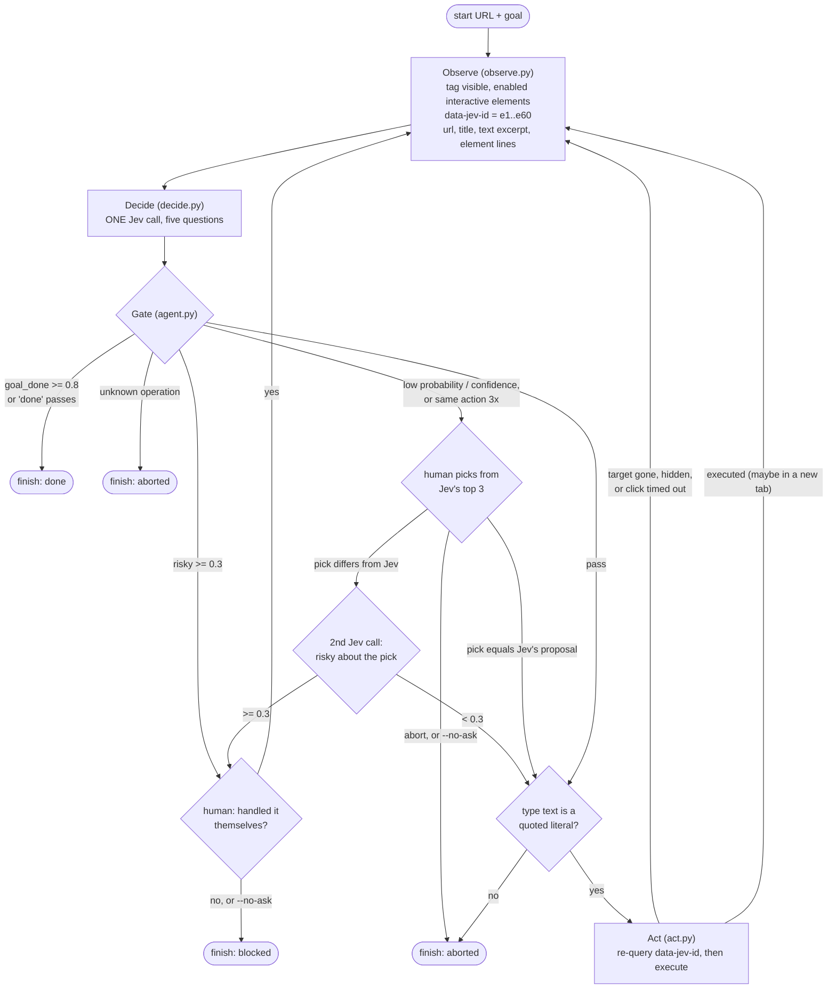
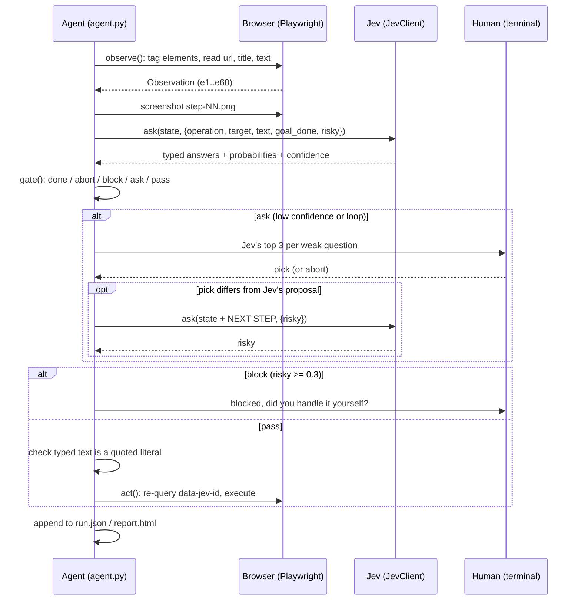

# How it works with Jev

This document explains how jev-web-agent drives a browser using only Jev, TypeSafe's System One
model, with no LLM anywhere. It follows the current code in `src/jev_web_agent/`. The
original approved spec (24/09/2026) is kept unchanged in [`spec.md`](spec.md).

## What Jev is

Jev is a decision model, not a text generator. You send it a text `state` and a set of typed
questions; it returns typed answers, one per question:

| Question type | What it asks | What comes back |
| --- | --- | --- |
| **Choice** | Which one of these options? | the chosen option, a probability for every option, and a `confidence` |
| **Score** | Where on this ordered scale? | a probability-weighted score, per-level probabilities, and a `confidence` |
| **Noul** | Is this statement true? | one number: the probability of yes (no separate confidence) |

Constraints that shape the whole design:

- **Text only.** Jev never sees an image, so the page has to be turned into text.
- **No generation.** Jev cannot write a search query, a URL or a selector. It can only pick
  among options the code offers it. The agent therefore builds every option list itself.
- **Calibrated probabilities.** Every Choice answer carries the full distribution, and the
  code thresholds it. `confidence` summarises how peaked the distribution is: 1.0 when all mass
  is on one option, lower as it spreads.
- **Context.** 32k tokens on OpenRouter. A typical step here is about 3,400 input tokens.

This agent uses Choice and Noul questions only.

## The loop

Each step observes the page, makes one Jev call, lets code gate the answers, and then acts.



### 1. Observe (`observe.py`)

Playwright runs a script in the page. It clears old tags, then collects links, buttons, inputs,
textareas, selects and elements with `role` button, link, textbox, searchbox, combobox, tab or
menuitem. It skips anything hidden, zero-sized or disabled, keeps document order, caps the list
at **60** (in-viewport elements first, the remaining slots filled from the top of the
document), and tags each kept element with `data-jev-id="eN"`. Each element becomes one line:

```
e3: searchbox "Search Wikipedia" value=""
e57: link "Guido van Rossum"
```

An `Observation` is pure data: url, title, a whitespace-collapsed text excerpt of up to 3,000
characters, and the elements. `render_state` turns it, together with the goal and the last 5
executed actions, into the state text sent to Jev.

### 2. Decide (`decide.py`): one call, five questions

Jev answers many questions in one call in parallel, so the agent asks everything a step
*might* need up front (speculative fan-out) and lets code decide which answers matter:

| Key | Type | Options |
| --- | --- | --- |
| `operation` | Choice | `click`, `type`, `press_enter`, `scroll_down`, `go_back`, `done`, each with a one-line description |
| `target` | Choice | one option per element id; the description is the element line |
| `text` | Choice | the goal's double-quoted literals, plus `(none)` |
| `goal_done` | Noul | "The goal has been achieved on the current page." |
| `risky` | Noul | "Taking this next step would buy, pay, send a message, post, delete, submit personal data, or log in." |

`target` is left out when the page has no elements and `text` when the goal has no quoted
literals.

**A real example.** This is step 4 of the live run *search for "Python", get to the article
about the programming language (not the snake), then open the article about its creator*
(`runs/2026-09-24_11-36-59`), trimmed. The request:

```json
{
  "model": "typesafe/jev-1.13",
  "state": "GOAL: search for \"Python\", get to the article about the programming language (not the snake), then open the article about its creator\nURL: https://en.wikipedia.org/wiki/Python_(programming_language)\nTITLE: Python (programming language) - Wikipedia\n\nPAGE TEXT (excerpt):\nJump to content Main menu Search Donate Create account Log in Contents hide (Top) History ...\n\nINTERACTIVE ELEMENTS (id: role \"name\"):\ne1: button \"Main menu\"\ne2: link \"\"\ne3: searchbox \"Search Wikipedia\" value=\"\"\n...\ne57: link \"Guido van Rossum\"\ne58: link \"Developer\"\ne59: link \"Python Software Foundation\"\ne60: link \"[2]\"\n\nLAST ACTIONS (oldest first):\n1. type [e3: searchbox \"Search Wikipedia\" value=\"\"] text=\"Python\" on https://en.wikipedia.org/wiki/Main_Page\n2. press_enter on https://en.wikipedia.org/wiki/Main_Page\n3. click [e37: link \"Python (programming language)\"] on https://en.wikipedia.org/wiki/Python\n",
  "questions": {
    "operation": {
      "type": "choice",
      "instructions": "Which single browser operation should be taken next to make progress toward the GOAL?",
      "criteria": {
        "click": "Click one of the listed interactive elements (a link, button, tab or menu item) because following or activating it leads toward the goal.",
        "type": "Type one of the goal's quoted text values into a listed text box or search box that does not already contain it.",
        "press_enter": "Press Enter to submit the text that was just typed; the box already shows the value the goal asks for.",
        "scroll_down": "Scroll down because what the goal needs is probably further down this page.",
        "go_back": "Go back to the previous page because this page is a wrong turn.",
        "done": "Stop: the current page already shows what the goal asks for."
      }
    },
    "target": {
      "type": "choice",
      "instructions": "If the next step clicks or types, which listed interactive element should it act on to make progress toward the GOAL?",
      "criteria": {
        "e1": "e1: button \"Main menu\"",
        "e3": "e3: searchbox \"Search Wikipedia\" value=\"\"",
        "e57": "e57: link \"Guido van Rossum\"",
        "...": "(60 options in total)"
      }
    },
    "text": {
      "type": "choice",
      "instructions": "If the next step types text, which of the GOAL's quoted values should be typed?",
      "criteria": { "Python": "Type \"Python\"", "(none)": "Nothing needs to be typed next." }
    },
    "goal_done": { "type": "noul", "instructions": "The goal has been achieved on the current page." },
    "risky": { "type": "noul", "instructions": "Taking this next step would buy, pay, send a message, post, delete, submit personal data, or log in." }
  }
}
```

The response (probabilities as recorded in `run.json`, trimmed to the top options):

```json
{
  "model": "typesafe/jev-1.13-20260917",
  "answers": {
    "operation": { "type": "choice", "choice": "click", "confidence": 0.99,
                   "probabilities": { "click": 0.99, "scroll_down": 0.01, "type": 0.0, "...": 0.0 } },
    "target":    { "type": "choice", "choice": "e57", "confidence": 1.0,
                   "probabilities": { "e57": 1.0, "e29": 0.0, "...": 0.0 } },
    "text":      { "type": "choice", "choice": "(none)", "confidence": 0.79,
                   "probabilities": { "(none)": 0.9, "Python": 0.1 } },
    "goal_done": { "type": "noul", "noul": 0.09 },
    "risky":     { "type": "noul", "noul": 0.09 }
  },
  "usage": { "input_tokens": 3474, "output_tokens": 675, "cost": 0.000145908 }
}
```

The gate needs `operation` and `target` for a click; both pass, so the agent clicks e57. The
`text` answer is ignored because a click does not type.

### 3. Gate (`agent.py`)

Code, not Jev, decides whether an answer is good enough to act on. The order matters:

1. **Done.** `goal_done >= 0.8`, or operation `done` passing the confidence gate, finishes the
   run.
2. **Unknown operation.** An `operation` outside the six known ones ends the run as `aborted`,
   with the reason.
3. **Risky.** `risky >= 0.3` blocks the step. It is never executed.
4. **Confidence.** Each answer the chosen operation depends on (`operation`; plus `target` for
   click and type; plus `text` for type) needs probability `>= 0.55` and confidence `>= 0.35`.
   `type` with `(none)` as its text fails this check. A failure asks the human.
5. **Loop.** The same (operation, target line, text, url) three times in a row asks the human.

All thresholds are CLI flags (`--min-prob`, `--min-conf`, `--done-threshold`,
`--risky-threshold`). `--max-steps` defaults to 15.

**Only quoted literals can be typed.** The agent can only ever type text you wrote in double
quotes in the goal: `search for "Alan Turing"` makes `Alan Turing` typeable and nothing else.
The `text` question only offers those literals. Since commit `09a4ddc` the invariant is also
enforced in code: before any `type` executes, whether Jev proposed it or a human picked it, the
agent checks `action.text` against `quoted_literals(goal)` and aborts the run if it doesn't
match. It does not rely on the API only returning listed options.

### 4. Act (`act.py`)

The target is re-queried by `data-jev-id` right before acting. If it has been removed or hidden
since the observation, nothing runs and the loop re-observes. Otherwise Playwright acts and
waits for the page to load:

- `click`: if the link opens a new tab (`target="_blank"`), the agent waits for that tab,
  brings it to the front and observes it from the next step.
- `type`: fills the box and marks it; a later `press_enter` goes to that box, not to whatever
  has focus.
- `scroll_down` scrolls by 80% of the viewport; `go_back` navigates back.
- A click or fill that times out (for example, an overlay covers the target) is reported and
  the loop re-observes instead of failing the run.

## One step, in sequence



## Human in the loop

When the gate asks, the terminal shows Jev's top 3 options for each question that needs a
human (with probabilities and what each option means). The human picks one or aborts.
`--no-ask` turns every ask into an abort, which is what tests and unattended runs use.

**Risk re-check of a human pick.** The fan-out `risky` answer was about Jev's own proposal. If
the human picks something different, that answer says nothing about the pick. So the agent
makes a second, narrow Jev call with a single `risky` question, adding the pick to the state as
`NEXT STEP (about to be executed): click [e1: button "Buy now"]`. At or above the threshold, the
pick goes down the same block path as the gate's block. A pick identical to Jev's proposal is
not re-checked.

On a block, the step is never executed by the agent. In the headed browser the human can do it
themselves and answer "continue" (the agent then re-observes), or abort.

## Backends

All Jev access goes through one protocol:

```python
class JevClient(Protocol):
    def ask(self, state: str, questions: Mapping[str, Question]) -> JevAnswers: ...
```

| `--backend` | Endpoint | Key | Default model | Implementation |
| --- | --- | --- | --- | --- |
| `openrouter` | `POST https://openrouter.ai/api/alpha/decisions` | `OPENROUTER_API_KEY` | `typesafe/jev-1.13` | `openrouter.py`: a thin httpx2 client with retries on 429/5xx/529 |
| `typesafe` | `POST https://api.typesafe.ai/v1/systemone` | `TYPESAFE_API_KEY` | `jev-latest` | `decide.TypeSafeJev` over the official `typesafe-sdk` client |

Without `--backend`, the agent uses `openrouter` when `OPENROUTER_API_KEY` is set and
`typesafe` otherwise. Both take the same `model` / `state` / `questions` request and return the
same `answers`. OpenRouter's Decisions API differs in two ways:

- `usage` also includes `cost` in USD.
- The schema only guarantees `choice` on a choice answer. The adapter reads a missing
  `confidence` or `probabilities` as zero certainty, which can never pass the gate.

The official `openrouter` Python SDK was not used: it covers the whole OpenRouter API and pins
`pydantic<2.13`, which conflicts with `typesafe-sdk`.

Tests use a scripted fake `JevClient`. Both real clients are also tested for real, with only
their HTTP transport replaced.

## Live results

These are five live runs on OpenRouter (`typesafe/jev-1.13`), headed, with `--no-ask` and the
default thresholds, recorded on 24/09/2026. The numbers come from each run's `run.json` and
`usage.json`. Latency is the total time spent in Jev calls, not wall-clock time. The runs were
recorded before the final review fixes (pick re-check, new-tab following, the typed-text check
in code); none of those paths came up in these runs.

| Task | Outcome | Steps | Operations | Lowest op confidence | Jev latency | Tokens in / out | Cost (USD) |
| --- | --- | --- | --- | --- | --- | --- | --- |
| `--task wiki`: search "Alan Turing", open his article | done (goal_done 0.95) | 3 | type, press_enter, done | 0.50 | 1.32 s | 10,128 / 2,029 | 0.000425 |
| `--task hn`: open the top story's comments | done ('done' passed the gate) | 2 | click, done | 0.78 | 0.93 s | 6,806 / 1,288 | 0.000286 |
| `--task books`: open "A Light in the Attic" | done (goal_done 0.96) | 2 | click, done | 0.99 | 0.82 s | 4,353 / 860 | 0.000183 |
| search "Ada Lovelace", open her article | done (goal_done 0.92) | 3 | type, press_enter, done | 0.59 | 1.42 s | 10,242 / 2,033 | 0.000430 |
| search "Python", programming language, then its creator | done (goal_done 0.96) | 5 | type, press_enter, click, click, done | 0.59 | 1.90 s | 17,173 / 3,372 | 0.000721 |

Observations:

- Every step's answers passed the gate; no run needed a human.
- The weakest decision in each Wikipedia search was `press_enter` right after typing
  (p 0.59 to 0.67, confidence 0.50 to 0.59). A click on the Search button was the runner-up.
- On the Python disambiguation page Jev picked `e37: link "Python (programming language)"`
  with p 0.97, choosing it over the snake entries.
- On HN the run ended because the `done` operation passed the gate (p 0.83), while the
  `goal_done` noul was 0.71, below its own 0.8 threshold. `risky` was 0.24 on that page, close
  to the 0.3 block.

## Known limits

- **The 60-element cap.** Busy pages are cut. In the Python run, the link Jev needed was
  `e57: link "Guido van Rossum"` in the infobox, element 57 of 60. The first paragraph also
  links to him and was on screen, but it didn't make the list: at least 60 elements were
  already in the viewport, and the infobox comes first in document order. Four more elements
  earlier in the page and the run would have had no Guido link to choose.
- **Tabs opened by script are not followed.** Only links with a `target` attribute (such as
  `target="_blank"`) are followed. A tab opened by `window.open` from a button leaves the agent
  on the old page.
- **English-first.** Question wording, operation descriptions and element roles are English.
  Pages in other languages have not been tested.
- **The page as text only.** Canvas content, images without alt text, and elements inside
  iframes or shadow DOM are not observed.
- **`risky` is a judgement, not a guarantee.** It is a model's probability. Never point the
  agent at a site where a single click can buy, send, post or delete.
- **Nouls have no confidence.** `goal_done` and `risky` are thresholded on their probability
  alone.

## Ideas and next steps

- Pagination for large pages: ask a `scroll_down` or a second observation window instead of a
  hard 60-element cap, or rank elements by relevance to the goal before capping.
- Follow `window.open` tabs by listening for new pages for a short grace period after every
  click.
- Use a Score question for "how close to the goal is this page" to detect regressions and
  trigger `go_back`.
- Structured state (a JSON object with named fields) instead of one text block, which the
  TypeSafe docs recommend for referencing fields from questions.
- Per-site risk policies: always block on known checkout or account paths regardless of `risky`.
- A replay mode that re-runs `run.json` states against a newer model and diffs the answers.
- Support `select` and checkbox operations, still restricted to options visible on the page.
